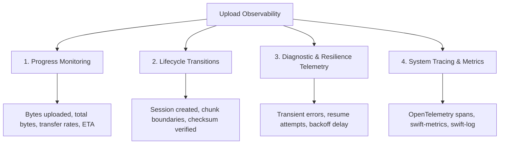
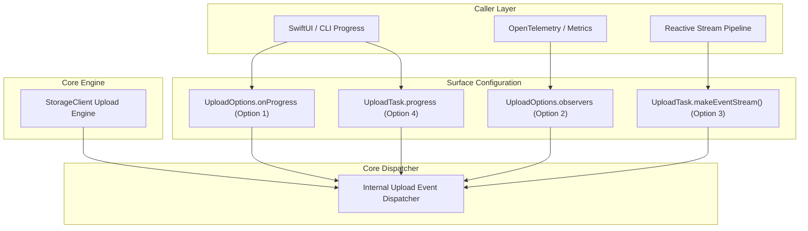

# Design Document: GCS Swift Client Library Upload Observability API

This document reviews the current design and explores architectural options for injecting observability into the Google Cloud Storage (GCS) Swift client library upload API.

---

## Goal

Provide a language-idiomatic, thread-safe, high-performance, and extensible mechanism for users to monitor upload progress, lifecycle transitions, and diagnostic/resilience events across both simple and resumable uploads.

---

## 1. Review of Current Upload Design

In the current implementation ([`UploadTask.swift`](file:///usr/local/google/home/chingor/code/google-cloud-swift/packages/storage/Sources/GoogleCloudStorage/UploadTask.swift) and [`StorageClient+Upload.swift`](file:///usr/local/google/home/chingor/code/google-cloud-swift/packages/storage/Sources/GoogleCloudStorage/StorageClient+Upload.swift)), upload monitoring is exposed via `UploadTask`:

```swift
public struct UploadStatus: Sendable {
    public var fractionCompleted: Double? { get }
    public let bytesUploaded: Int64
    public let totalBytes: Int64?
    public let uploadId: String?
}

public struct UploadTask: Sendable {
    public func makeStatusStream() -> AsyncStream<UploadStatus>
    public var value: Object { get async throws }
    public func cancel()
}
```

### Identified Limitations

1. **Unicast `AsyncStream` Bottleneck:**
   The current `UploadTask` holds a single `AsyncStream<UploadStatus>` instance and returns it directly in `makeStatusStream()`. Because Swift's `AsyncStream` is unicast, multiple concurrent consumers (e.g., a progress UI, an analytics recorder, and an operational logger) will race, leading to dropped or partitioned events.

2. **Concurrency Ergonomics & Orchestration Overhead:**
   Because `upload(...)` launches a detached background task and returns `UploadTask`, consuming progress while awaiting the result requires callers to manage concurrent execution branches:
   ```swift
   let task = storageClient.upload(fileURL, to: bucket, as: object)
   
   // Caller must juggle concurrent tasks
   async let result = task.value
   for await status in task.makeStatusStream() {
       updateProgressBar(status.fractionCompleted ?? 0)
   }
   let object = try await result
   ```
   If the upload completes rapidly (e.g. simple uploads or cached small payloads), the task may finish before the consumer begins iterating the stream.

3. **Coarse Event Granularity:**
   `UploadStatus` only exposes byte counts and upload IDs. It does not provide visibility into:
   - **Phase transitions:** Session initiation, chunk upload boundaries, checksum computation, and completion.
   - **Resilience events:** Transient errors, retry attempts, backoff sleep durations, and resumable session status queries.
   - **Chunk-level metrics:** Per-chunk latency, throughput rates, and chunk attempt indices.

4. **Lack of Global Configuration & Ecosystem Integration:**
   Observability cannot be configured once on `StorageClientOptions.upload` or inherited across requests. There is also no out-of-the-box integration with standard Swift telemetry frameworks (`swift-log`, `swift-metrics`, `swift-distributed-tracing`) or Apple platform primitives (`Foundation.Progress`).

---

## 2. Dimensions of Upload Observability

Upload observability spans four distinct dimensions:



1. **Progress Monitoring:** Tracking byte progress, fraction completed, and transfer speed for interactive UI or CLI progress bars.
2. **Lifecycle Transitions:** Granular visibility into upload milestones (initiating session, uploading chunk $N$, calculating CRC32C checksums, finalizing object).
3. **Diagnostic & Resilience Telemetry:** Detailed insight into transient connection drops, retry attempts, backoff delays, and resume probes.
4. **System Tracing & Metrics:** Integration with APM backends via OpenTelemetry spans, Prometheus metrics counters, and structured logging.

---

## 3. Design Options

### Option 1: Inline Closures in `UploadOptions` (Ergonomic & Direct)

Add closure hooks directly into `UploadOptions`, allowing progress and lifecycle events to be defined declaratively per-request or globally on `StorageClientOptions.upload`.

#### Proposed Interface

```swift
public struct UploadProgress: Sendable, Equatable {
    public let bytesUploaded: Int64
    public let totalBytes: Int64?
    public var fractionCompleted: Double? {
        guard let totalBytes = totalBytes, totalBytes > 0 else { return nil }
        return Double(bytesUploaded) / Double(totalBytes)
    }
}

public struct UploadRetryEvent: Sendable {
    public let attempt: Int
    public let error: Error
    public let delay: Duration
    public let resumedFromOffset: Int64
}

public struct UploadOptions: Sendable {
    // Existing options (chunkSize, preconditions, checksums, etc.)
    ...
    
    /// Invoked whenever upload byte progress advances.
    public var onProgress: (@Sendable (UploadProgress) -> Void)?
    
    /// Invoked when a transient failure occurs and a retry/resume is initiated.
    public var onRetry: (@Sendable (UploadRetryEvent) -> Void)?
}
```

#### Usage Example

```swift
let options = UploadOptions().with {
    $0.onProgress = { progress in
        print("Uploaded \(progress.bytesUploaded)/\(progress.totalBytes ?? 0) bytes")
    }
    $0.onRetry = { event in
        print("Retry attempt \(event.attempt) after \(event.delay) due to \(event.error)")
    }
}

let object = try await storageClient.upload(fileURL, to: "my-bucket", as: "file.bin", options: options).value
```

#### Trade-offs
- **Pros:**
  - **Zero Concurrency Overhead:** Eliminates the need to coordinate background stream readers and `async let` branches.
  - **Global Defaults:** Can be set on `StorageClientOptions.upload` so all client operations inherit standard monitoring.
  - **Developer Experience:** Natural and lightweight for CLI scripts and simple app views.
- **Cons:**
  - Callbacks must be `@Sendable` and non-blocking.
  - Less composable for reactive async streams or event filtering pipelines.

---

### Option 2: Protocol-Based Listener (`UploadObserver`)

Define a generic `OperationObserver` protocol and specialized `UploadObserver` for listening to lifecycle, progress, and resilience events.

#### Proposed Interface

```swift
public protocol OperationObserver<Context, Progress, Result>: Sendable {
    associatedtype Context: Sendable
    associatedtype Progress: Sendable
    associatedtype Result: Sendable

    func operationDidStart(context: Context)
    func progressUpdated(_ progress: Progress)
    func operationDidRetry(attempt: Int, error: any Error, backoff: Duration)
    func operationDidComplete(result: Result, totalDuration: Duration)
    func operationDidFail(error: any Error)
}

public protocol UploadObserver: OperationObserver
where Context == StorageOperationContext, Progress == UploadProgress, Result == Object {}
```

#### Multi-Observer Registration

```swift
public struct UploadOptions: Sendable {
    ...
    /// Observers registered for this upload operation.
    public var observers: [any UploadObserver] = []
}
```

#### Usage Example

```swift
// Example custom observer for metrics reporting
struct UploadMetricsObserver: UploadObserver {
    let meter: any MetricsMeter
    
    func progressUpdated(_ progress: UploadProgress) {
        meter.recordGauge("gcs.upload.bytes_uploaded", progress.bytesUploaded)
    }
    
    func operationDidRetry(attempt: Int, error: any Error, backoff: Duration) {
        meter.incrementCounter("gcs.upload.retries")
    }
}

// Configure client options with default observers
let clientOptions = StorageClientOptions().with {
    $0.upload.observers = [
        LoggingUploadObserver(logger: myLogger),
        UploadMetricsObserver(meter: myMeter)
    ]
}
```

#### Trade-offs
- **Pros:**
  - **Clean Separation of Concerns:** Separates network execution logic from logging, tracing, and metric collection.
  - **Multi-Subscriber Support:** Composite observer dispatcher safely multicasts events to all listeners synchronously or asynchronously.
  - **Modularity:** Pre-built adapters (e.g. for `swift-log` or `swift-metrics`) can live in separate modules if desired.
- **Cons:**
  - Slightly more verbose for single-use progress callbacks compared to simple closures.

---

### Option 3: Rich Event Stream with Multicast Broadcasting (`AsyncSequence<UploadEvent>`)

Upgrade the existing `UploadStatus` snapshot to a rich enum-based `UploadEvent` stream, backed by a true multicast broadcaster actor inside `UploadTask`.

#### Proposed Interface

```swift
public enum UploadEvent: Sendable {
    case initiated(uploadId: String?)
    case progress(UploadProgress)
    case chunkStarted(chunkIndex: Int, byteRange: Range<Int64>)
    case chunkCompleted(chunkIndex: Int, byteRange: Range<Int64>, duration: Duration)
    case resuming(offset: Int64, reason: String)
    case retrying(attempt: Int, error: Error, delay: Duration)
    case completed(Object, totalDuration: Duration)
    case failed(Error)
}

public struct UploadTask: Sendable {
    /// Creates an independent, multicast asynchronous stream of all upload events.
    public func makeEventStream() -> AsyncStream<UploadEvent>
    
    /// Convenience stream yielding only progress updates.
    public func makeProgressStream() -> AsyncStream<UploadProgress> {
        makeEventStream().compactMap { event in
            if case .progress(let p) = event { return p }
            return nil
        }
    }
    
    public var value: Object { get async throws }
    public func cancel()
}
```

#### Usage Example

```swift
let task = storageClient.upload(fileURL, to: bucket, as: object)

// Multi-consumer subscription
Task {
    for await event in task.makeEventStream() {
        switch event {
        case .retrying(let attempt, let error, let delay):
            logger.warning("Upload retry #\(attempt) after \(delay): \(error)")
        case .chunkCompleted(let index, let range, let duration):
            logger.debug("Chunk \(index) (\(range.count) bytes) uploaded in \(duration)")
        default:
            break
        }
    }
}
```

#### Trade-offs
- **Pros:**
  - **Async-Native:** Leverages Swift Concurrency streams and reactive paradigms.
  - **Composable:** Works seamlessly with `AsyncAlgorithms` (e.g. `.debounce`, `.throttle`, `.filter`).
  - **Full Fidelity:** Captures the complete timeline of the upload lifecycle.
- **Cons:**
  - Requires implementing a thread-safe multicast broadcaster (actor-backed) inside `UploadTask`.
  - Consumers must coordinate awaiting `task.value` alongside reading the stream.

---

### Option 4: Standard Platform & Ecosystem Integrations

Integrate directly with standard abstractions across both Apple platforms and Server-Side Swift.

#### 1. Apple Ecosystem (`Foundation.Progress`)
Expose an `NSProgress` / `Foundation.Progress` instance on `UploadTask`:
```swift
public struct UploadTask: Sendable {
    /// Foundation Progress object for UIKit / AppKit / SwiftUI integration.
    public var progress: Progress { get }
}
```
* **Benefits:** Native binding to SwiftUI (`ProgressView(task.progress)`) and automatic cancellation chaining when the parent progress is cancelled.

#### 2. Server Ecosystem (`swift-log`, `swift-metrics`, OpenTelemetry)
- **Logging:** Wire chunk uploads, session creation, and retry events directly into GAX's [`ClientOptions.logger`](file:///usr/local/google/home/chingor/code/google-cloud-swift/packages/gax/Sources/GoogleCloudGax/ClientOptions.swift#L75) (debug/info for milestones, warning for retries).
- **Tracing / OpenTelemetry:** Wrap upload operations and individual chunk PUT requests in OpenTelemetry spans, attaching standard semantic attributes (`gcs.bucket`, `gcs.object`, `gcs.upload_type`, `gcs.chunk_index`, `gcs.bytes_uploaded`).

---

## 4. Comparison Matrix

| Criteria | Option 1: Inline Closures | Option 2: `UploadObserver` Protocol | Option 3: `UploadEvent` Multicast Stream | Option 4: Standard Ecosystem |
| :--- | :--- | :--- | :--- | :--- |
| **Primary Use Case** | Simple UI/CLI progress updates | Enterprise telemetry, metrics, logging | Reactive async pipelines | Native SwiftUI & Server APM |
| **Concurrency Boilerplate** | **None** (inline) | **Low** (synchronous hooks) | **Medium** (requires `Task` / `async let`) | **None** (handled by framework) |
| **Multi-Subscriber** | Via composite closures | **High** (observer list) | **High** (multicast actor) | High (platform native) |
| **Extensibility** | Low | **High** (modular plugins) | High (event streams) | High |
| **Integration Complexity** | Minimal | Low | Medium | Low |

---

## 5. Recommended Unified Architecture

A tiered hybrid architecture combining these options provides both simplicity for basic use cases and power for enterprise telemetry:



1. **Core Dispatcher:** The internal upload engine dispatches events through a centralized, thread-safe dispatcher conforming to `UploadObserver`.
2. **Convenience Closures (`Option 1`):** `UploadOptions.onProgress` is bridged directly into the dispatcher.
3. **Pluggable Observers (`Option 2`):** `UploadOptions.observers` and `StorageClientOptions.upload.observers` allow registering multiple enterprise observers (logging, metrics, tracing).
4. **Reactive Multicast (`Option 3`):** `UploadTask.makeEventStream()` provides an independent multicast `AsyncStream` for reactive consumers.
5. **Platform Bridge (`Option 4`):** Built-in observers bridge to `Foundation.Progress` and `Logging.Logger`.
